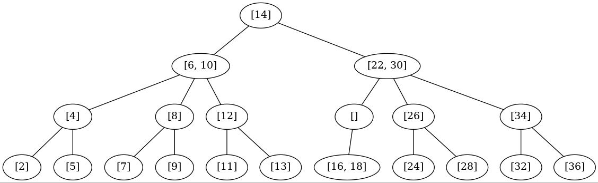
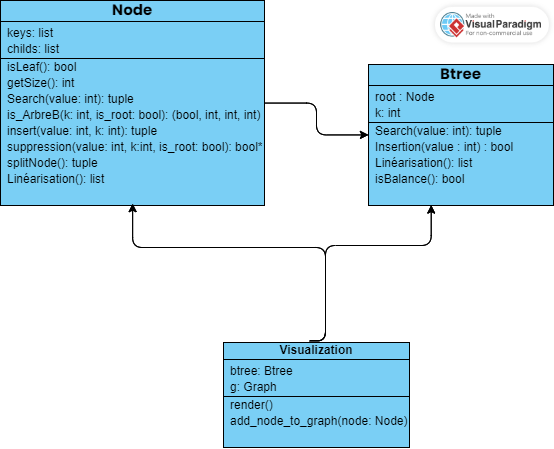

# Projet - L3 - S6

## authors

Mamadu Lamarana Bah  
Loïc Scoth

## Problèmes et erreurs

Le projet contient quelques problèmes:
La suppression n'est pas terminé, celle-ci gère certains cas feuille mais ne fonctionne pas correctement.  
expérimentation suppr1: niveau 2 de l'arbre, il y a un noeud vide due au rééquilibrage après une fusion   

les cas racine et noeud interne ne sont pas pris en compte.

## Description du projet

Le projet consiste à la création et à la représentation d'un arbre binaire, constitué de noeud et de feuilles, que nous créons.  
Celui-ci est modulable, nous pouvons ajouter ou supprimer des noeuds mais également rechercher l'emplacement d'un noeud dans cet arbre.

## commande

Expérimentation :  
projet-s-6-loic-scoth-etu-mamadulamarana-bah-etu/src$ python3 experimentation.py  

Test:  
projet-s-6-loic-scoth-etu-mamadulamarana-bah-etu/src$ python3 BTree.py  

projet-s-6-loic-scoth-etu-mamadulamarana-bah-etu/src$ python3 Node.py  

projet-s-6-loic-scoth-etu-mamadulamarana-bah-etu/src$ python3 util.py  

## Status

Terminé, suppression non fini

## UML

Voici un UML simple de notre projet :  

## Compléxité

### util

recheche dicho : O(log(n))

### Node

search: O(log(n)) si arbre équilibré, en O(n) dans le pire des cas (arbre déséquilibré, parcours donc tout les noeuds)  

is_ArbreB: O(n)  

insert: O(log(n)) dans le meilleur des cas, O(h) dans le pire des cas ,h correspond à la hauteur de l'arbre  

suppression: O(log(n)) dans le meilleur de cas, O(h + n) dans le pire des cas  

splitNode: O(n)  

linearisation: O(n)  

### Btree

search: voir Node  

insertion: voir Node 

linearisation: voir Node  

isBalance: voir Node  

suppr: voir Node (non terminé)  

### Semaine 1

Mise en place du projet, compréhension du sujet et création des premières classes.
Début dichotomie.

### semaine 2

Fin dichotomie, création de search et insert.

### semaine 3

Création documentation, création util et changement d'emplacement des méthodes pour plus de clarté.  
Début de la méthode split.

### semaine 4

Début des tests, avancé sur split et insertion.

### semaine 5

Suite des tests, suite d'insertion.

### semaine 6

Insertion suite + quelques compléments de tests.

### semzine 7

Fin insertion.

### semaine 8

Test Btree, création de la méthode suppression.

### semaine 9

Création linéarisation et première représentation(classe visualization).

### semaine 10

suite suppression, création de méthode complémentaire (isArbreB) et rectification des tests suite à une modification du code.

### semaine 11

Suite suppression, fonctionne pour le cas d'une feuille.

### semaine 12

Suite suppression.

### semaine 13

suite suppression.

### semaine 14

suite suppression et expérimentation.

### semaine 15

Dernières modifs et soutenance.